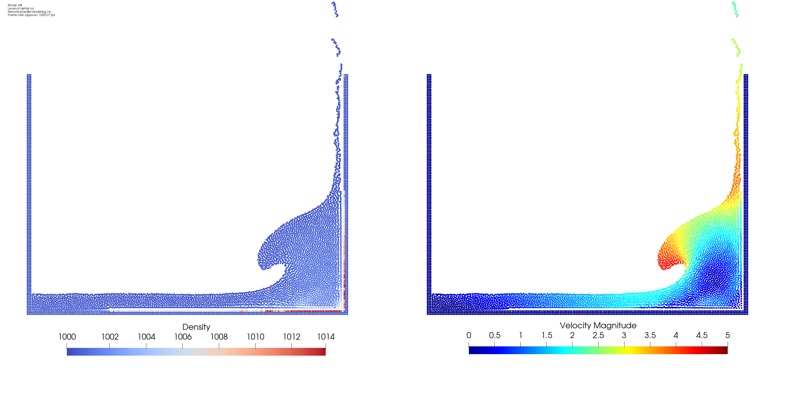
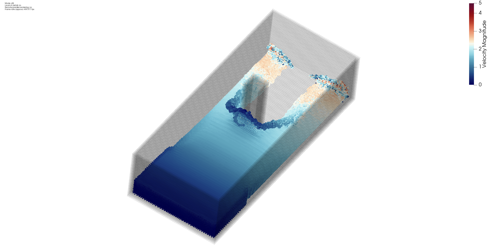

# SPH Example

An example of how to write a relatively simple SPH (Smoothed Particle Hydrodynamics) dam-break simulation in Julia. Feel free to star the package if it helped you and please do let me know if you ended up using this to learn SPH yourself, used it in your teaching etc. It is really a motivation booster to hear!

If for some reason you end up pointing to this repository due to you writing a thesis, paper etc., I would love to know!

The code can produce a 2D dam-break ([@DamBreak2D-Video](https://www.youtube.com/watch?v=7kDVjZkc_TI)):



Or if you are really patient (1+ day to calculate) a 3D case ([@DamBreak3D-Video](https://www.youtube.com/watch?v=_2e6LopvIe8))::



## Description

The purpose of this code is to serve as an introduction to the SPH (Smoothed Particle Hydrodynamics) method. I have been working in SPH for quite a few years now and noticed that although great software packages exist in this field, it was difficult to find a "simple" example of setting up an SPH solver.

To fill this "void" I decided to go about writing one and learning the necessary steps to do so. The choice of language was Julia, since I've been part of this community for some years and really believe in the concept behind Julia. Also it is a language with a syntax complexity level of around Python, so it would still serve as good inspiration for others wanting to write their own dam break code to look through this.

Key-elements of the code are:

- Weakly Compressible SPH
  - Density varies about ~1% in time, for numerical reasons and the pressure equation is based on the density. This ensured by enforcing a Mach Number of 0.1, by artificially setting the speed of sound of the fluid (c₀) to ten times the highest velocity in the flow (manual input) 
- Multi-threaded approach
  - Multi-threading has been added, especially for the SimulationEquations.jl. This gives a great speed up to the code. Loops can easily be turned to single threading, by removing the `@tturbo` macro if needed, for development
- Dynamic Boundary Condition (as in DualSPHysics)
  - DualSPHysics is one of the most well-known SPH packages. Thought it would be a good idea to show how one implements this boundary condition.
- Density Diffusion
  - Necessary to produce a non-noise density field, which is important for the momentum equation, since pressure is a function of density in weakly compressible SPH
- Wendland Quintic Kernel (as in DualSPHysics)
  - One of the simpler kernels which does not require tensile correction to be applied.

*Please* remember that this code is not made to be performant. It is made to teach and showcase one way to code a relatively simple SPH dam break.

## Getting Started

### Introduction
The package is structured into "input", "example" and "src". "input" contains some pre-generated particle layouts from DualSPHysics in .csv format. These paths are specified in the "RunSimulation" function found in "example/MainSimulation.jl", not as an input but as something which should be changed inside the function and recompiled. After installing the package, run the code in "example/MainSimulation.jl" to start your first simulation. 

The "src" package contains all the code files used in this process. An overview of these is shown;

* PreProcess
  * Function for loading in the files in "input". 
* PostProcess
  * Function to output .vtp files. "ProduceVTP.jl" is a hand-rolled custom solution for those interested in that.
* AuxillaryFunctions
  * Not used, but provided as a service to extract all particle ids based on a neighbour list
* TimeStepping
  * Some simple time stepping controls
* SimulationConstantsConfigurations
  * The interface for stating the most relevant simulation constants is found here
* SimulationDataArrays
  * Some functions for resizing and resetting array values as needed
* SimulationMetaDataConfiguration
  * The interface for the meta data associated with a simulation, such as total time, save location etc.
* SimulationEquations
  * All SPH related physics functions
* SPHExample
  * The "glue" package file exporting all the functions, to allow for `using SPH`. 

A few key-packages are used and automatically imported. Listed here for your convenience:

* CellListMap
  * A package which allows to return an array of tuples consisting of (particle i, particle j, distance between particle i and particle j), which significantly simplifies and speeds up the calculation process. It is CPU based only. 
* WriteVTK
  * A package which outputs results calculated in this package to the .vtp format. Remember to view results in Paraview you have to select something other than "Solid Color" and for example "Point Gaussian" instead of "Surface" repesentation.
* LoopVectorization
  * Following some simple rules for writing loops, it automatically multi-threads code. As a note, it is necessary to ensure that loop iterations are truly independent when doing multithreading.

Without these, this example would have been significantly harder to write - and of course thank you to the Julia eco-system as a whole. 

### Executing program

In `example/MainSimulation.jl`  you will find:

```julia

# The actual simulation code above, which you as an user can change..

# Initialize Simulation
begin
    T = Float64
    SimMetaData  = SimulationMetaData{T}(
                                    SimulationName="MySimulation", 
                                    SaveLocation=raw"E:\SecondApproach\Results", 
                                    MaxIterations=10001,
                                    OutputIteration=50,
    )
    # Initialze the constants to use
    SimConstants = SimulationConstants{T}()
    # Clean up folder before running (remember to make folder before hand!)
    foreach(rm, filter(endswith(".vtp"), readdir(SimMetaData.SaveLocation,join=true)))

    # And here we run the function - enjoy!
    RunSimulation(
        FluidCSV     = "./input/FluidPoints_Dp0.02.csv",
        BoundCSV     = "./input/BoundaryPoints_Dp0.02.csv",
        SimMetaData  = SimMetaData,
        SimConstants = SimConstants
    )
end
```

`SimConstants` holds some initial parameters which work for the above mentioned `FluidCSV` and `BoundCSV` out of the box, a 2d dam break. Other than these inputs you should not have to change anything else. Of course the idea is that you can overwrite functions using syntax such as `PostSPH.FunctionName` or change the main simulation loop how you please and see the effects. 

## Help

Any questions about the code feel free to post an issue on this repository. Please do understand it might take some time for me to respond back.

## Authors

Written by Ahmed Salih [@AhmedSalih3D](https://github.com/AhmedSalih3d)

## Version History

* Version 0.2 | A highly optimized version for CPU, with extremely few allocations after the initial array allocation. Only the neighbour search and saving of data allocates memory now. Recommend to use this. 
* Version 0.1 | A revised version of main, with slight improvements
* main        | A cleaned up version of the original release version

## License

This project is licensed under the MIT License - see the LICENSE.md file for details

## Acknowledgments

DualSPHysics (https://dual.sphysics.org/) was a great inspiration for this code.

Thank you to the general Julia eco-system and especially Leandro Martínez (https://github.com/lmiq) who is also the author of CellListMap.jl. He was a great help in understanding how to best use the neighbour-list algorithm. Leandro was also a big part of reviewing the whole code base and suggesting/showing potential optimizations. 

Thank you for PharmCat (https://github.com/PharmCat) for his suggestions in pull requests and providing of code, which I later implemented into the library. Much appreciated. 
